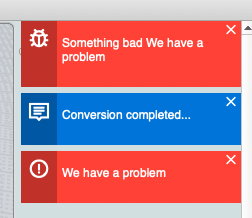

# PluginSDK for MoI

MoI](http://moi3d.com) (Moment of Inspiration) is a superb CAD software that's designed to be simple and easy to use. MoI is mainly designed for CAD solids and surface modeling and provides a great JavaScript API to let you expand and modify the application.

PluginSDK is inspired by ATOM/VSCode plugin architecture, albeit with the limitations of QTWebView (V5) and ES5.

PluginSDK is a community-based javascript library that compliments MoI's [API](doc_api.md) to make extending MoI even easier.


**Disclaimer:** This software is provided as is and it will have bugs. This software may cause unexpected errors in MoI, do not bother Michael with the problems you encounter using this library, use the GitHub Issue trackers to report problems. New versions of MoI may break this library. All work on this library is made by volunteers, be nice!


# Installing PluginSDK

> Before you start make sure you are familiar with [scripting](doc_scripting.md) in MoI.

- Create the directory `plugins` in MoI's appdata folder.

- Create the directory `libs` in MoI's appdata folder.

- Copy the `PluginSDK` folder inside your libs folder.

- Copy the `PluginSDK.js` file to your `startup` folder inside MoI's appdata folder.


# Anatomy of the PluginSDK

PluginSDK operates parallel to MoI commands and has its own UI and invocation means.


The PluginSDK will bootstrap itself as a startup script and inject HTML and code into the MoI main window. This step injects reusable html widgets/and elements and functionality.

Plugins that want to run under the PluginSDK are installed in the "Plugins" folder.


# MoI Application

In javascript the main interface for the PluginSDK is `moiApp`. The `moiApp` serves as the main namespace used to access the functionality provided by the SDK.


# Displaying Notifications



`moiApp.showNotification(strType, strMessage, boolIsModal)`

Notifications are displayed on the side panel of MoI. Notifications float on top of the side panel content. Some notifications will fade out by themselves depending on the `type` and others will stay on the side until the user closes the dialog. Notifications are not modal. If you set isModal to true then a traditional alert will be created.

| Type | Description |
| --- | --- |
| `"error"` | General error. |
| `"error-code"` | An error executing plugin code. |
| `"info"` | An informative message that will disappear by itself.


# Open a Window

```js
var aPromise = moiApp.showDialog( url|html , options)
```

The parameter `options` is a plain object used to configure our dialog.


| Properties | Description |
| --- | --- |
| `width` | Initial width of the dialog. |
| `height` | Initial height of the dialog. |
| `minWidth` | Minimum width of the dialog. |
| `minHeight` | Minimum height of the dialog. |
| `resizable` | Boolean. Indicate if the dialog is resizable. |
| `onViewLoaded` | Function. The event handler for the given event. |
| `onViewClosed` | Function. The event handler for the given event. |


```js

moiApp.showDialog( strHTML , myOptionsObj ).then(function(view){
	moi.ui.alert("My dialog is ready!");
});
```

The [`moiView `](#moiView) is a helper object to interact with your dialog.

| Events | Description |
| --- | --- |
| `view_loaded` | Raised when the dialog is loaded and ready. |
| `view_closed` | Raised when the dialog is closed. |
| `view_resize` | Raised when the dialog changes size. |


# moiView

| Event | Description |
| --- | --- |
| `moiView.document` | The HTMLDocument. |
| `moiView.root` | The root HTMLElement of this view.. |
| `moiView.moiWindow` | The moiWindow instance. |
| `moiView.cookie` | A plain object that can be used to share data. |
| `moiView.close()` | Close the dialog. |
| `moiView.sendMessage(msgName, data)` | Broadcast a message to the PluginSDK. Message can be handled by a controller or observer. |
| `moiView.onElementAdded(fnCallback)` | Observe DOM changes and executes callbacks when an element is added.<br>The callback signature is `function(el)`. |
| `moiView.onElementRemoved(fnCallback)` | Observe DOM changes and executes callbacks when an element is removed.<br>The callback signature is `function(el)`. |


# UI Style Guide

We use [Line Awesome](https://icons8.com/line-awesome) Icons. You can find the icon cheatsheet [here](https://icons8.com/line-awesome).

Add an icon with `<i class="la la-beer'></i>`.

## Buttons

```html
<button class="btn">Regular</button>
<button class="btn btn-sm">Small</button>
<button class="btn btn-primary">Primary</button>
<button class="btn btn-primary selected">Selected</button>
<button class="btn btn-success">Success</button>
<button class="btn btn-success selected">Success</button><br>
<button class="btn btn-error">Error</button>
<button class="btn btn-error selected">Error</button>
<button class="btn btn-default icon la-play"> Play</button>
<button class="btn btn-success icon la-crow">Crow</button>
```

A button Group
```html
<div class="btn-group">
	<button class="btn">One</button>
	<button class="btn">Two</button>
	<button class="btn">Three</button>
</div>
```

# Inputs

```html
<input class="input-text" type="text" placeholder="Text">
<input class="input-search" type="search" placeholder="Search">
<textarea class="input-textarea" placeholder="Text Area"></textarea>

<input class="input-number" type="number" min="1" max="10" placeholder="1-10">
```
```html
<label class="input-label"><input class="input-radio" type="radio" name="radio" checked=""> Radio</label>

<label class="input-label"><input class="input-radio" type="radio" name="radio"> Radio</label>

<label class="input-label"><input class="input-checkbox" type="checkbox" checked=""> Checkbox</label>

<label class="input-label"><input class="input-toggle" type="checkbox" checked=""> Toggle</label>

```


# Panels

```html
<div id="mypanel" class="moi-panel padded">
	<div class="moi-panel-header">
		<h1>My Header</h1>
		<p>This is some text explaining something.</p>
		<div class="moi-panel-header-controls btn-group">
			<button class="btn">Collapse All</button>
			<button class="btn">Expand All</button></div>
		</div>
	</div>
	<div class="moi-section">
		<h1 class="section-heading">Widgets</h1>
		<h2>Box 1</h2>
		<div class="moi-section-boxed">
			...
		</div>
		<h2>Box 2</h2>
		<div class="moi-section-boxed">
			...
		</div>
	</div>
</div>
```